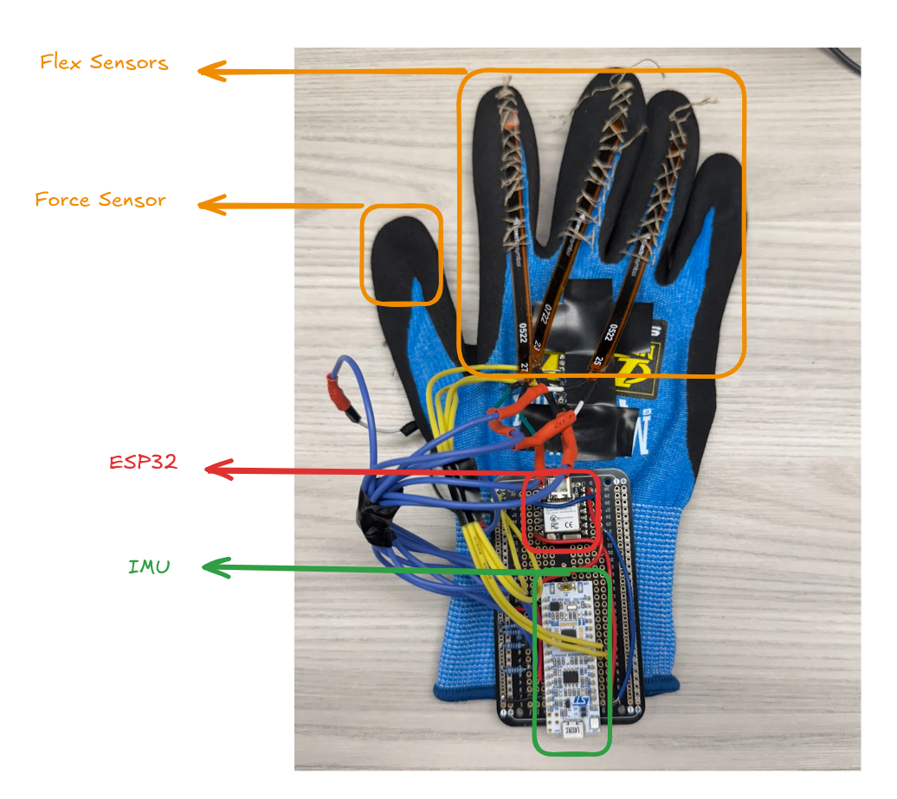
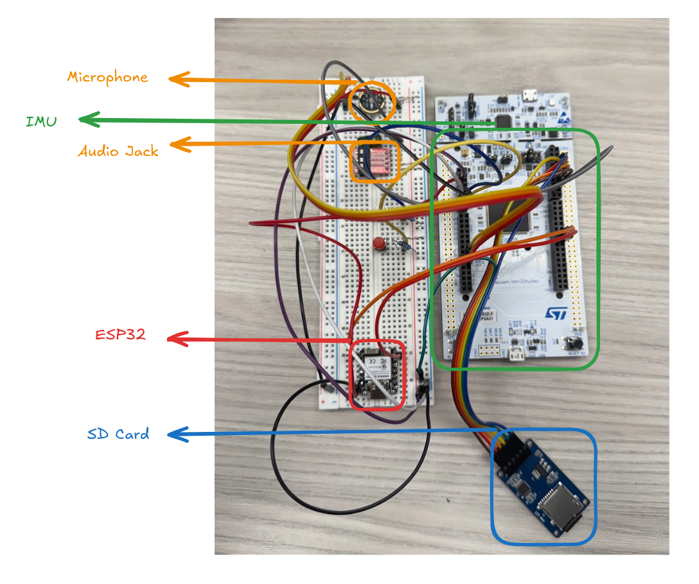

<!--
Template source: awesome-readme-template
This README has been adapted for an embedded STM32 firmware repo.
-->

  
  <h1>373FP (Glove + Board firmware)</h1>
  
  

    Two STM32CubeIDE projects for a glove-based input device and a companion board.
  

   
<h4>
    <a href="#getting-started">Getting started</a>
   · 
    <a href="#usage">Usage</a>
  </h4>

 

<!-- Table of Contents -->
# Table of Contents

- [About the Project](#about-the-project)
  * [Tech Stack](#tech-stack)
  * [Features](#features)
  * [Hardware](#hardware)
  * [Data formats](#data-formats)
- [Getting Started](#getting-started)
  * [Prerequisites](#prerequisites)
  * [Installation](#installation)
  * [Run Locally](#run-locally)
- [Usage](#usage)
- [Contributing](#contributing)
  

<!-- About the Project -->
## About the Project

This project was an attempt to recreate the Imogen Heap Musical Glove. The core idea was to create a wearable glove that enables the user to record, loop, edit, and playback music using gesture controls. Below are images of the Glove and the Board.

 
  

 
  

This repo contains two STM32CubeIDE projects:

- `Glove/`: reads 4 analog inputs (flex/force sensors) via ADC+DMA, reads an I2C accelerometer for hand orientation, builds a small command packet, and transmits it over UART.
- `Board/`: recieves command packet from Glove and transitions through FSM accordingly. Reads and writes to an SD card via SPI. Recording is done via I2S communication protocol and MEMS microphone. Playback is done via DAC and audio jack.

<!-- TechStack -->
### Tech Stack

- **Firmware**
  - [STM32CubeIDE](https://www.st.com/en/development-tools/stm32cubeide.html) (CubeMX-generated HAL projects)
  - STM32 HAL + CMSIS
  - C (GCC toolchain)

<!-- Hardware -->
### Hardware

#### MCUs
- **Glove**: NUCLEO-L432KC
- **Board**: STM32-L4R5ZI-P 

#### Components

##### Glove
- **Wireless Module**: ESP32
- **Flex Sensors**: 4x Flex sensors
- **Force Sensors**: 1x Force sensor
- **Accelerometer**: I2C accelerometer

##### Board
- **SD Card**: SD Card 8GB 
- **Microphone**: MEMS microphone
- **Audio Jack**: 3.5mm analog audio jack

> Note: for authoritative pinout/peripheral configuration, check the `.ioc` files in `Glove/` and `Board/`.

<!-- Data formats -->
### Data formats

#### Glove → Board Command Packet

| Byte | Name | Meaning |
|---:|---|---|
| 0 | `mode` | Mode index (0..3), advanced via "tap" threshold on ADC channel 0 |
| 1 | `flex1` | 1 if ADC ch1 exceeds threshold, else 0 |
| 2 | `flex2` | 1 if ADC ch2 exceeds threshold, else 0 |
| 3 | `flex3` | 1 if ADC ch3 exceeds threshold, else 0 |
| 4 | `fingers_up` | 1 if accelerometer-derived pose says fingers up, else 0 |
| 5 | `palm_up` | 1 if accelerometer-derived pose says palm up, else 0 |
| 6 | `roll_x_1to10` | roll around X axis mapped to integer 1..10 |

<!-- Getting Started -->
## Getting Started

<!-- Prerequisites -->
### Prerequisites

- STM32CubeIDE (recommended)
- A STM32-L4R5ZI-P (or compatible STM32L4R5ZI target) for the Board
- A NUCLEO-L432KC (or compatible STM32L432KCUx target) for the Glove
- USB cable(s) for ST-Link programming and Virtual COM Port
- A SD Card 8GB for the Board
- A MEMS microphone for the Board
- A 3.5mm audio jack for the Board
- A ESP32 for the Glove and Board
- A Flex sensor for the Glove
- A Force sensor for the Glove
- A I2C accelerometer for the Glove

<!-- Installation -->
### Installation

Clone this repo (or download as ZIP) and open the project(s) in STM32CubeIDE.

<!-- Run Locally -->
### Run Locally

In STM32CubeIDE:

- Import `Glove/` as an existing STM32CubeIDE project.
- Import `Board/` as an existing STM32CubeIDE project.
- Build and flash each project to its target board.

If you modify peripherals/pins, prefer doing it via the `.ioc` file and re-generating code (keeping user-code blocks).

<!-- Usage -->
## Usage

### Glove project (`Glove/`)

- Flash `Glove` to a NUCLEO-L432KC.
- Open a serial monitor on the ST-Link VCP port at respective baud rate (115200) to view debug output.
- The firmware:
  - starts ADC+DMA sampling of 4 channels and captures a baseline after ~500 ms
  - reads an I2C accelerometer
  - sends a 7-byte command packet over `USART1`

### Board project (`Board/`)

- Flash `Board` to a NUCLEO-L432KC.
- Open a serial monitor on the ST-Link VCP port at respective baud rate (115200) to view debug output.
- Controls a FSM to record, loop, edit, and playback music using gesture controls.

### Controls and Commands
- Lift hand up and bend fingers to record a loop
- Return hand to regular position (unbend fingers and lower hand) to stop recording
- Tap the button on the board to switch between modes
- Tilt hand left and right to adjust the roll value (1..10)
- Left hand and bend fingers again to record and layer a new loop
- Flip hand over to delete the current loop

<!-- Contributing -->
## Contributing

Contributions are always welcome!

If you plan to change pinouts/peripherals, please update the `.ioc` file(s) and mention the changed wiring in the PR/commit description.
